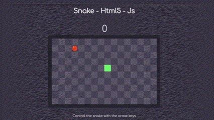

[⬅ Go Back](https://github.com/JpMunhozOliveira)

  
   
  
 
  

# Description 📜

This is a simple Snake game created using JavaScript and HTML. Snake is one of the most addictive and popular games of all time 📱. Developed with web technologies, the game features a small snake that players must control to collect food and grow.

The gameplay of the game is simple yet challenging, requiring precise coordination and reflexes to avoid collisions with the game's boundaries or the snake's own body. As the snake eats the food, it grows, and the player needs to avoid the snake colliding with itself.

## Preview 🔍

 

